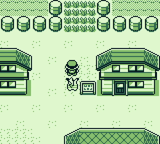

#  

CryBoy is a Gameboy emulator written in Crystal. The goal of this project is an efficient Gameboy emulator with highly readable code.

This would not be possible without the [Pan Docs](https://gbdev.io/pandocs), [izik's opcode table](https://izik1.github.io/gbops), or the [gzb80 opcode reference](https://rednex.github.io/rgbds/gbz80.7.html). A thanks also goes out to [PyBoy](https://github.com/Baekalfen/PyBoy), which was a useful reference when I first started this project.

## Installation

[SDL2](https://www.libsdl.org/) is a requirement for this project. Install that in whichever way you see fit.

After cloning the respository, you can install the required shards with `shards install`. If you don't do this directly, they'll be installed when you build the project.

## Usage

After installing the dependencies, the project can be built with `shards build --release`. At this point, the binary lives in `bin/cryboy`. The binary takes a an optional boot rom path and a rom path as its arguments: `bin/cryboy /path/to/rom` or `bin/cryboy /path/to/bootrom /path/to/rom`.

## Features and Remaining Work

CryBoy is still a work in progress. As of right now, all of the following features are supported

- Passing all of [blargg's cpu tests](https://github.com/retrio/gb-test-roms/tree/master/cpu_instrs).
- Passing all of [blargg's instruction timing tests](https://github.com/retrio/gb-test-roms/tree/master/instr_timing).
- Passing all of [blargg's memory timing tests](https://github.com/retrio/gb-test-roms/tree/master/mem_timing).
- Passing all but one of the [mooneye-gb timer tests](https://github.com/Gekkio/mooneye-gb/tree/master/tests/acceptance/timer).
- PPU renders on a scanline basis.
- PPU draws background, window, and sprites.
- Save files work as intended, and are compatible with other emulators like BGB.
- MBC1 cartridges are supported (except for multicarts).
- MBC3 cartridges are supported (except timers).
- MBC5 cartridges are supported.
- Controller support.
- Audio channels are working well enough that I don't notice issues in game.

There is still a lot missing from CryBoy. Some of these missing pieces include

- Audio processing
  - Failing many of blargg's audio tests.
  - Sweep on Channel 1 really isn't implemented properly.
- Picture processing
  - Pixel FIFO
    - [Pixel FIFO](https://github.com/corybsa/pandocs/blob/develop/content/pixel_fifo.md) will likely only be relevant in 0.01% of games, so it's not a priority. It's a nice-to-have at some point down the road.
- Game Boy Color support
  - There is a sizable amount of work necessary to get CGB support. However, now that SDL Textures are working properly, adding color to the display shouldn't be challenging.
- Misc
  - Failing the mooneye-gb rapid_toggle timer test by 4 T-cycles. Needs to be debugged.

## Contributing

1. Fork it (<https://github.com/mattrberry/CryBoy/fork>)
2. Create your feature branch (`git checkout -b my-new-feature`)
3. Commit your changes (`git commit -am 'Add some feature'`)
4. Push to the branch (`git push origin my-new-feature`)
5. Create a new Pull Request

## Contributors

- [Matthew Berry](https://github.com/mattrberry) - creator and maintainer
